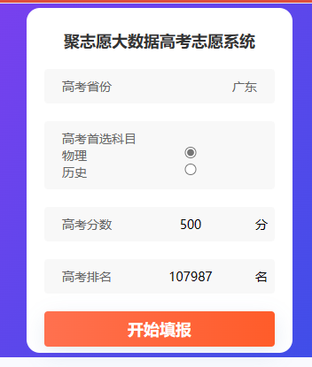
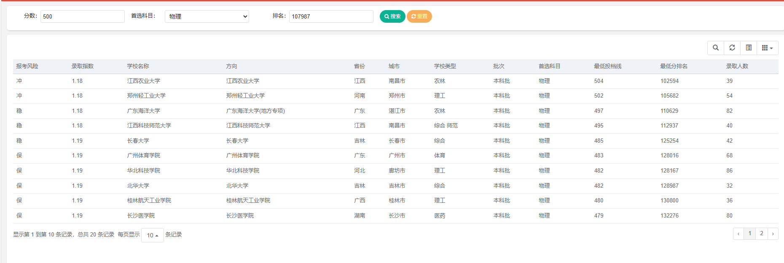
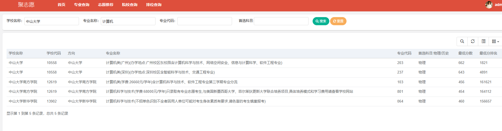
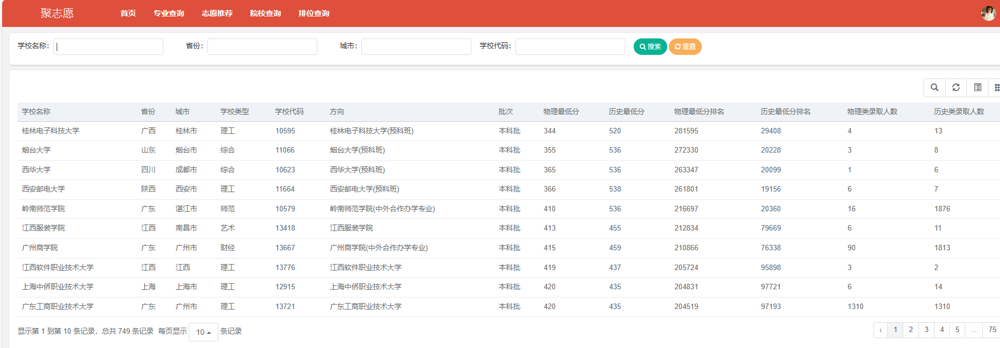

# 高考志愿填报系统

**大学时候的课程设计系统，本系统是基于往年高考成绩，通过内置算法给出个人高考志愿推荐**

## 使用指南

sql文件放在了sql文件夹下，创建名字为gk的数据库并且更改项目application配置文件里面的mysql地址和账户密码，启动项目，访问localhost:8080即可进入系统

## 模块介绍

**登录首页**

账户admin，密码admin123即可进入

**主页面**

在此输入分数并且点击填报，会计算这个分数在去年的排名，并跳转到推荐页面

可以看到按报考的风险对能报的学校进行排序

专业查询页面，可以根据填入学校或者专业名称、代码这些，查询想要的专业的分数线和排名

在院校查询页面，可以根据不同条件查看该大学的分数排名和录取人数

